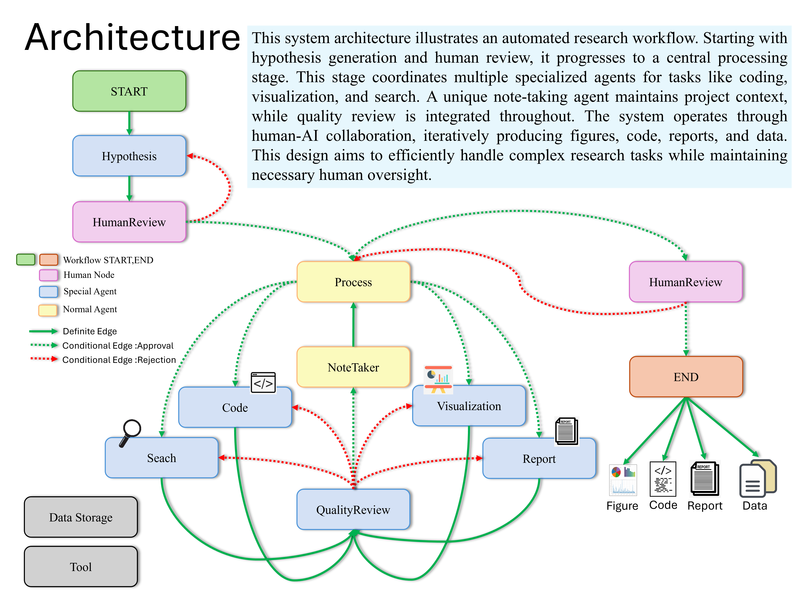

# 🤖 AnalyticsFlow - Multi-Agent Data Analysis System


**AnalyticsFlow** is an advanced AI-powered multi-agent system designed to revolutionize data analysis through intelligent automation. Built with cutting-edge technologies including LangChain, OpenAI GPT models, and LangGraph, it provides comprehensive data analysis workflows from hypothesis generation to final reporting.

## 🌟 Key Features

### 🧠 Intelligent Multi-Agent Architecture
- **9 Specialized Agents** working in coordination for comprehensive analysis
- **Dynamic Workflow Management** using LangGraph for task orchestration
- **Real-time Coordination** through state management between agents
- **Context Preservation** across the entire analysis pipeline

### 📊 Data Analysis Capabilities
- **Automated Data Exploration** - AI agents examine your data structure and content
- **Code Generation & Execution** - Agents write and run Python analysis code
- **Statistical Analysis** - Basic statistical summaries and hypothesis testing
- **Data Visualization** - Generated charts and graphs saved as PNG files
- **Quality Review** - Automated checking of analysis results

### 🎯 Core Functionality
- **Hypothesis Development** - AI-driven research questions and analysis direction
- **Web Search Integration** - Agents can search for relevant information online
- **Dynamic Code Creation** - Python scripts generated based on your data and requirements
- **Report Generation** - Markdown reports with findings and visualizations
- **Interactive Web Interface** - User-friendly Streamlit dashboard for easy operation

### 🔧 Technical Features
- **Multi-format Support** - CSV data input with extensible architecture
- **Error Handling & Recovery** - Robust error management throughout the pipeline
- **Progress Tracking** - Real-time monitoring of analysis stages
- **Result Export** - Download generated reports, code, and visualizations
- **Template System** - Pre-built analysis prompts for common use cases

## 🏗️ System Architecture



<details>
<summary>ASCII Architecture Diagram (click to expand)</summary>

```
┌─────────────────┐    ┌─────────────────┐    ┌─────────────────┐
│   Hypothesis    │    │    Process      │    │     Search      │
│     Agent       │◄──►│     Agent       │◄──►│     Agent       │
└─────────────────┘    └─────────────────┘    └─────────────────┘
         │                       │                       │
         ▼                       ▼                       ▼
┌─────────────────┐    ┌─────────────────┐    ┌─────────────────┐
│      Code       │    │ Visualization   │    │     Report      │
│     Agent       │◄──►│     Agent       │◄──►│     Agent       │
└─────────────────┘    └─────────────────┘    └─────────────────┘
         │                       │                       │
         ▼                       ▼                       ▼
┌─────────────────┐    ┌─────────────────┐    ┌─────────────────┐
│ Quality Review  │    │  Note Taker     │    │    Refiner      │
│     Agent       │◄──►│     Agent       │◄──►│     Agent       │
└─────────────────┘    └─────────────────┘    └─────────────────┘
```

</details>

## 🚀 Quick Start

### Prerequisites
- Python 3.10 or higher
- OpenAI API Key
- 8GB+ RAM recommended
- Modern web browser

### Installation

1. **Clone the Repository**
```bash
git clone https://github.com/knightstark7/AnalyticsFlow-Multi-Agent-Data-Analysis-System.git
cd AnalyticsFlow-Multi-Agent-Data-Analysis-System
```

2. **Create Virtual Environment**
```bash
# Using conda (recommended)
conda create -n analyticsflow python=3.10
conda activate analyticsflow

# Using venv
python -m venv analyticsflow
source analyticsflow/bin/activate  # On Windows: analyticsflow\Scripts\activate
```

3. **Install Dependencies**
```bash
pip install -r requirements.txt
```

4. **Environment Configuration**

Create a `.env` file in the root directory:
```env
# Required: OpenAI API Key
OPENAI_API_KEY=your_openai_api_key

# Required: Data Storage Path
DATA_STORAGE_PATH=./data_storage/

# Required: Working Directory
WORKING_DIRECTORY=./data_storage/

# Optional: LangChain Tracing
LANGCHAIN_API_KEY=your_langchain_api_key
LANGCHAIN_TRACING_V2=true
LANGCHAIN_PROJECT=AnalyticsFlow

# Optional: Firecrawl for web search
FIRECRAWL_API_KEY=your_firecrawl_api_key

# Optional: Conda Environment (for code execution)
CONDA_PATH=/path/to/anaconda3
CONDA_ENV=analyticsflow
```

5. **Launch the Application**
```bash
streamlit run streamlit_app.py
```

## 📋 Usage Guide

### 🌐 Web Interface (Streamlit)

1. **Upload Data**: Choose your CSV file for analysis
2. **Select Analysis Type**: Choose from pre-built templates or create custom analysis
3. **Start Analysis**: Click "Start Analysis" and monitor progress
4. **Review Results**: Explore results in organized tabs

### 📓 Jupyter Notebook

1. **Open Notebook**:
```bash
jupyter notebook main.ipynb
```

2. **Configure Analysis**:
```python
user_input = '''
datapath:your_data.csv
Perform comprehensive analysis with machine learning insights
'''
```

3. **Run Analysis**: Execute all cells to start the multi-agent workflow

### 🐍 Python Script

```bash
python main.py
```

## 🤖 Agent Specifications

### 🔬 **Hypothesis Agent**
- **Purpose**: Generate research hypotheses and analysis directions
- **Capabilities**: Statistical hypothesis formulation, research question generation
- **Output**: Structured hypothesis with testable predictions

### 📊 **Process Agent** (Coordinator)
- **Purpose**: Orchestrate the entire analysis workflow
- **Capabilities**: Task distribution, workflow management, decision making
- **Output**: Process decisions and task assignments

### 🔍 **Search Agent**
- **Purpose**: Gather external information and literature
- **Capabilities**: Web search, literature review, data source identification
- **Output**: Relevant research papers, datasets, and contextual information

### 💻 **Code Agent**
- **Purpose**: Generate and execute analysis code
- **Capabilities**: Python code generation, data processing, ML implementation
- **Output**: Executable code, analysis results, model performance metrics

### 📈 **Visualization Agent**
- **Purpose**: Create data visualizations and charts
- **Capabilities**: Interactive plots, statistical charts, dashboard creation
- **Output**: PNG files, interactive visualizations, chart recommendations

### 📝 **Report Agent**
- **Purpose**: Generate comprehensive analysis reports
- **Capabilities**: Structured reporting, insight summarization, recommendation generation
- **Output**: Markdown reports, executive summaries, technical documentation

### ✅ **Quality Review Agent**
- **Purpose**: Validate analysis quality and accuracy
- **Capabilities**: Result verification, bias detection, recommendation assessment
- **Output**: Quality scores, improvement suggestions, validation reports

### 📋 **Note Taker Agent**
- **Purpose**: Maintain context and state throughout analysis
- **Capabilities**: Context preservation, workflow tracking, state management
- **Output**: Process logs, state summaries, workflow documentation

### 🔧 **Refiner Agent**
- **Purpose**: Finalize and polish analysis outputs
- **Capabilities**: Result compilation, formatting, final quality checks
- **Output**: Polished reports, final recommendations, formatted deliverables

## 📊 Analysis Templates

The system provides pre-defined analysis prompts to help users get started quickly. These templates send specific instructions to the multi-agent system:

### 🎯 **General Analysis**
**Prompt**: "Perform comprehensive data analysis to find important patterns and insights"
- The agents will perform exploratory data analysis
- Generate statistical summaries and visualizations
- Identify patterns and provide insights based on the data

### 📈 **Trend Analysis** 
**Prompt**: "Analyze time trends and predict future trends"
- Focuses the agents on temporal patterns in data
- Attempts to create time-based visualizations if date columns exist
- May include basic forecasting depending on data structure

### 👥 **Customer Segmentation**
**Prompt**: "Segment customers based on purchasing behavior and characteristics"
- Directs agents to look for customer groupings
- Will attempt clustering if appropriate columns are found
- Generates customer profile analysis

### 💰 **Sales Performance**
**Prompt**: "Evaluate sales performance across time, products, and channels"
- Focuses on sales-related metrics and KPIs
- Creates performance dashboards and charts
- Analyzes revenue patterns and trends

### 🎨 **Custom Analysis**
**Prompt**: User-defined requirements
- Allows complete customization of analysis goals
- Users can specify exact requirements
- Agents adapt their approach based on custom instructions

> **Note**: These templates are high-level prompts that guide the multi-agent system. The actual analysis capabilities depend on your data structure and the AI agents' interpretation of the requirements. Results may vary based on data quality and complexity.

## 📁 Project Structure

```
AnalyticsFlow/
├── 📁 core/                    # Core system modules
│   ├── 🐍 workflow.py         # Workflow management
│   ├── 🐍 language_models.py  # LLM configurations
│   ├── 🐍 router.py           # Agent routing logic
│   ├── 🐍 node.py             # Agent node implementations
│   └── 🐍 state.py            # State management
├── 📁 data_storage/            # Data and results storage
├── 📁 prompts/                 # Agent prompts and templates
├── 🐍 streamlit_app.py        # Web interface
├── 🐍 main.py                 # Script execution
├── 📓 main.ipynb              # Jupyter notebook
├── 🐍 logger.py               # Logging configuration
├── 🐍 load_cfg.py             # Configuration loader
├── 📄 requirements.txt        # Dependencies
├── 🔧 .env.example            # Environment template
└── 📖 README.md               # This file
```

## ⚙️ Configuration

### 🔧 Environment Variables

| Variable | Required | Description |
|----------|----------|-------------|
| `OPENAI_API_KEY` | ✅ | OpenAI API key for GPT models |
| `DATA_STORAGE_PATH` | ✅ | Path for data storage |
| `WORKING_DIRECTORY` | ✅ | Working directory for analysis |
| `LANGCHAIN_API_KEY` | ❌ | LangChain tracing (optional) |
| `FIRECRAWL_API_KEY` | ❌ | Web search capabilities |
| `CONDA_PATH` | ❌ | Conda installation path |
| `CONDA_ENV` | ❌ | Conda environment name |

### 🎛️ System Settings

```python
# Workflow Configuration
RECURSION_LIMIT = 3000
STREAM_MODE = "values"
DEBUG_MODE = False

# Agent Settings
MAX_CONTEXT_LENGTH = 4000
TEMPERATURE = 0.1
MODEL_NAME = "gpt-4-turbo-preview"
```

## ⚠️ Current Capabilities & Limitations

### ✅ What AnalyticsFlow Can Do
- **Generate Python Code**: AI agents create analysis scripts based on your data and requirements
- **Execute Analysis**: Run generated code and capture results
- **Create Visualizations**: Generate charts and save them as PNG files
- **Write Reports**: Create markdown reports with findings and insights
- **Web Search**: Find relevant information to supplement analysis
- **Quality Review**: Check and validate analysis results
- **Multi-Agent Coordination**: Orchestrate complex workflows through specialized agents

### ⚠️ Important Limitations
- **Depends on AI Quality**: Results are only as good as the underlying language models
- **Limited ML Automation**: While agents can write ML code, there's no guaranteed model selection or hyperparameter tuning
- **Data Format**: Currently optimized for CSV files
- **Error Handling**: While improved, complex data issues may still cause failures
- **Performance**: Analysis time varies significantly based on data complexity and API response times
- **Cost**: Uses OpenAI API calls extensively, which incur costs based on usage

### 🎯 Best Use Cases
- **Exploratory Data Analysis** for unfamiliar datasets
- **Quick Statistical Summaries** and basic insights
- **Automated Report Generation** for routine analysis
- **Educational Purposes** to see how AI approaches data analysis
- **Rapid Prototyping** of analysis workflows

> **Note**: This is an experimental AI system. Always review and validate the generated code and results before using them for important decisions.

## 📜 License

This project is licensed under the MIT License - see the [LICENSE](LICENSE) file for details.

## 🙏 Acknowledgments

- **[DataGen](https://github.com/starpig1129/DATAGEN)** - Many thanks to original inspiration for multi-agent data analysis
- **OpenAI** for providing powerful language models
- **LangChain** for the agent framework
- **Streamlit** for the web interface
---

<div align="center">

**⭐ Star this repository if you find it helpful!**

[🐛 Report Bug](https://github.com/knightstark7/AnalyticsFlow-Multi-Agent-Data-Analysis-System/issues) • [✨ Request Feature](https://github.com/knightstark7/AnalyticsFlow-Multi-Agent-Data-Analysis-System/issues) • [💬 Join Discussion](https://github.com/knightstark7/AnalyticsFlow-Multi-Agent-Data-Analysis-System/discussions)

Made with ❤️ by Tran Nguyen Huan

</div>
