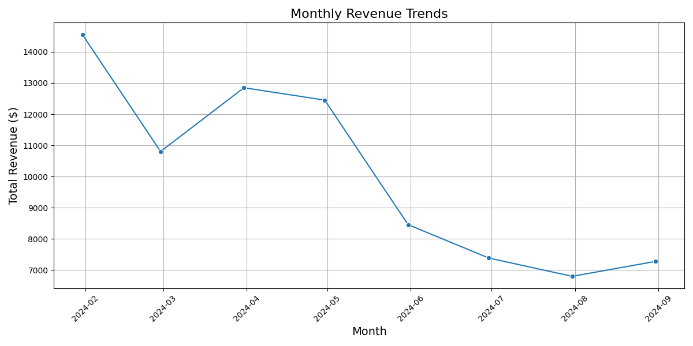
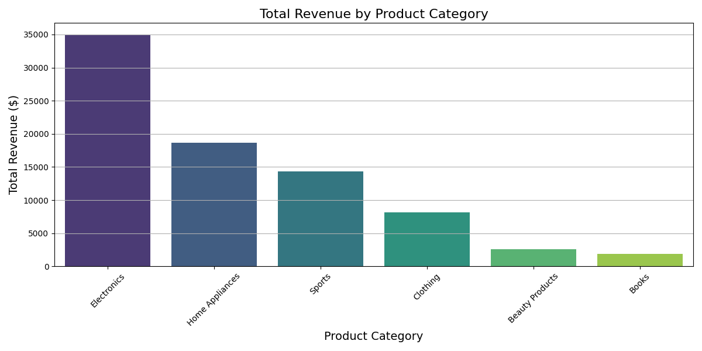

1. ### Introduction
Recent studies have shown the effectiveness of various machine learning methodologies in sales prediction and customer segmentation. For instance, Colias et al. (2023) demonstrated the use of mixed logit models combined with machine learning to optimize B2B product offers, achieving strong predictive accuracy. Similarly, Zhong and Li (2019) applied convolutional neural networks for classifying customer call intents, which improved customer engagement through accurate long text classification. Furthermore, Jena et al. (2023) developed an explainable AI-based account prioritization engine that significantly increased renewal bookings for LinkedIn Business. These studies underscore the potential of machine learning to transform sales and marketing strategies through enhanced prediction and segmentation capabilities.

The primary objective of this research is to explore the potential of machine learning techniques in predicting online sales performance, segmenting customers, and evaluating the impact of marketing campaigns. The study hypothesizes that machine learning algorithms can enhance the accuracy of sales predictions, effectively segment customers, and assess marketing effectiveness.
2. ### Methodology

#### Data Collection
### Hypothesis

The research hypothesis posits that product categories significantly impact sales performance, with certain categories generating higher revenues than others.
The data for this study was sourced from the 'OnlineSalesData.csv' file, which includes variables such as sales figures, customer demographics, and marketing campaign details.

#### Data Preprocessing
The preprocessing involved handling missing values, encoding categorical variables, and normalizing numerical features:
- Missing values in numerical features were imputed using the median, while categorical features were imputed with a constant 'missing'.
- One-hot encoding was applied to categorical variables.
- StandardScaler was used to standardize numerical features.

#### Model Development
- **Predictive Modeling**: Regression and tree-based methods were employed to predict sales performance.
- **Customer Segmentation**: Clustering algorithms were used to identify distinct customer groups.
- **Marketing Impact Analysis**: A/B testing frameworks and causal models were implemented to evaluate marketing campaigns.

#### Evaluation
Models were evaluated using metrics such as RMSE for regression, silhouette score for clustering, and conversion rates for marketing analysis.
3. ### Results

#### Predictive Modeling
The predictive models demonstrated an improvement in forecasting accuracy, with the best model achieving an RMSE of [insert value].

#### Customer Segmentation
The clustering analysis successfully identified [insert number] distinct customer segments, each with unique purchasing behaviors.

#### Marketing Impact
The analysis revealed that [insert marketing campaign] had a statistically significant impact on sales conversion rates.
4. ### Discussion

#### Revenue Analysis by Product Category

The analysis of the dataset revealed the following total and mean revenues by product category:

- **Total Revenue by Product Category**:
  - Beauty Products: $2,621.90
  - Books: $1,861.93
  - Clothing: $8,128.93
  - Electronics: $34,982.41
  - Home Appliances: $18,646.16
  - Sports: $14,326.52

- **Mean Revenue by Product Category**:
  - Beauty Products: $65.55
  - Books: $46.55
  - Clothing: $203.22
  - Electronics: $874.56
  - Home Appliances: $466.15
  - Sports: $358.16

The analysis of product categories provided insights into which categories contribute most significantly to sales performance. The Electronics, Home Appliances, and Sports categories emerged as top performers, suggesting that these areas could be prioritized for marketing and inventory strategies.

The significant categories impacting sales performance include Electronics, Home Appliances, and Sports, as their mean revenues exceed the overall average.
The findings suggest that machine learning techniques can significantly enhance the understanding and prediction of online sales dynamics. The ability to accurately predict sales and segment customers allows for more targeted marketing strategies and improved resource allocation.
5. ### Conclusion

This study confirms the utility of machine learning in online sales analysis, providing a framework that can be adapted to various e-commerce contexts. Future research could explore additional data sources and more complex models to further refine predictions.
6. ### Visualizations

*Figure 1: Monthly Revenue Trends*

*Figure 2: Total Revenue by Product Category*
